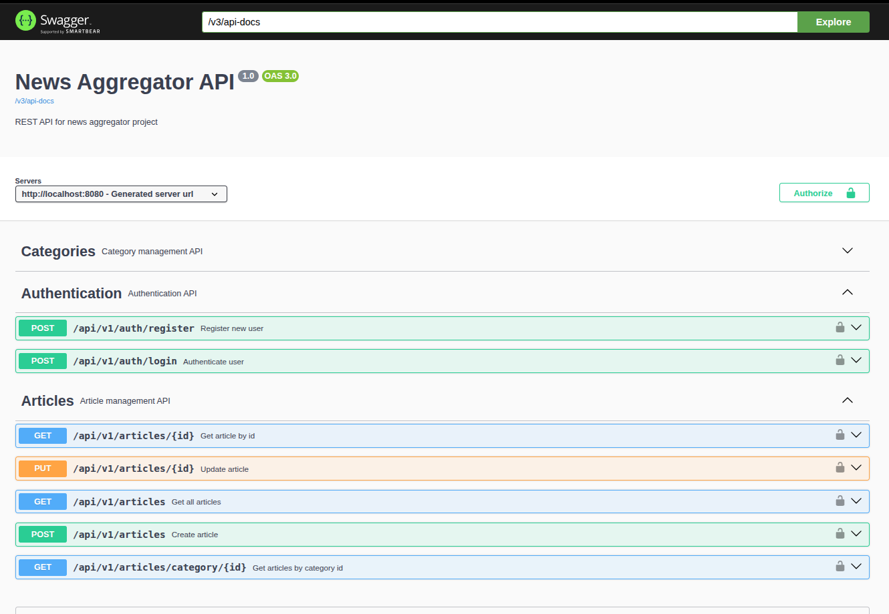

# News Aggregator API

REST API backend application built with Spring Boot.

Проект начинался как учебный CRUD и постепенно был расширен до production-style backend приложения с JWT authentication, role-based authorization, Swagger documentation, filtering, pagination и PostgreSQL persistence.

---

## Tech Stack

* Java 17
* Spring Boot 3
* Spring Security
* JWT Authentication
* Spring Data JPA / Hibernate
* PostgreSQL
* Liquibase
* Swagger / OpenAPI
* Gradle
* JUnit 5 / MockMvc

---

## Features

### Authentication & Authorization

* JWT-based authentication
* User registration and login
* Role-based access control
* Protected admin endpoints

### Articles & Categories

* CRUD operations
* Pagination
* Dynamic filtering with Specifications
* Validation
* Global exception handling

### Documentation

* Swagger/OpenAPI integration
* Bearer token authorization support

---

## Project Structure

Проект организован по feature-based architecture:

```text
article/
category/
security/
user/
common/
```

Каждая feature содержит:

* controller
* service
* repository
* dto
* mapper
* specification

---

## Security

Реализован custom JWT authentication flow:

```text
Login
→ JWT generation
→ JwtAuthenticationFilter
→ SecurityContext
→ Role-based authorization
```

Используется:

* Spring Security
* OncePerRequestFilter
* UserDetailsService
* BCrypt password hashing

---

## Database

Используется:

* PostgreSQL
* Liquibase migrations

Миграции находятся в:

```text
src/main/resources/db/changelog
```

---

## API Documentation

Swagger UI:

```text
http://localhost:8080/swagger-ui/index.html
```

### Swagger Preview



---

## Running the Project

### 1. Clone repository

```bash
git clone <your-repository-url>
```

---

### 2. Configure local properties

Скопировать:

```text
application-example.yml
```

в:

```text
application-local.yml
```

и заполнить своими значениями.

---

### 3. Run PostgreSQL with Docker

Start PostgreSQL container:

```bash
docker compose up -d
```

Stop containers:

```bash
docker compose down
```

PostgreSQL will be available at:

```text
localhost:5432
```

Database name:

```text
news
```

---

### 4. Start application

```bash
./gradlew bootRun
```

---

## Testing

Используются:

* JUnit 5
* MockMvc

Покрыты:

* controller tests
* validation scenarios
* exception handling scenarios

---

## Future Improvements

Планируемые улучшения:

* Docker support
* Testcontainers
* CI/CD
* Refresh tokens
* Redis caching
* Deploy

---

## Author

Roman Gudkov

Transitioning from QA Automation to Backend Development.
